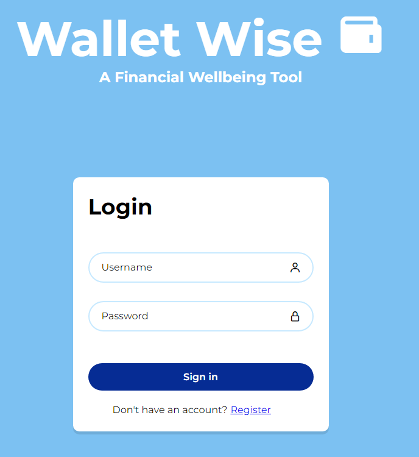

#  Wallet Wise : Monthly Expense Tracker

## A monthly insights tracker that categorizes your transactions to give you insight on your spending habits

**Getting Started:** 
Visit this [link](https://monthly-expense-tracker-2324e228fac8.herokuapp.com/)!

**[Planning Materials](https://trello.com/b/x5ueIHkt/crud-appproject)** 

Use this applictation to help organize your spending habits! Create,edit, and manage your monthly transactions easily.

Technologies:
* Javascript
* CSS
* HTML
* MongoDB
* Express
* Node.js

### Next Steps
* An even more responsive design
* A budget system
* Added charts for more insights
